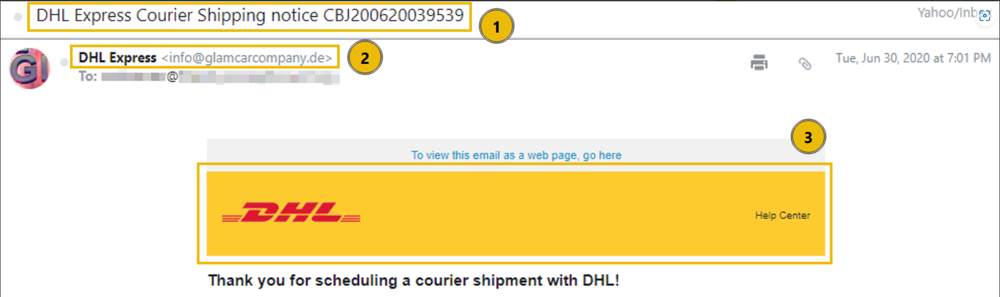
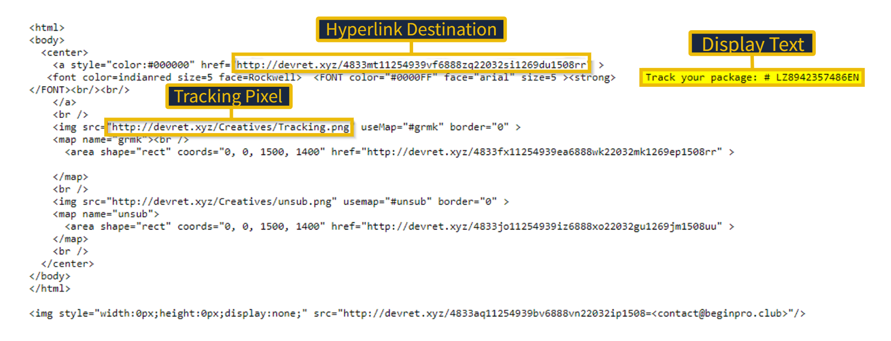
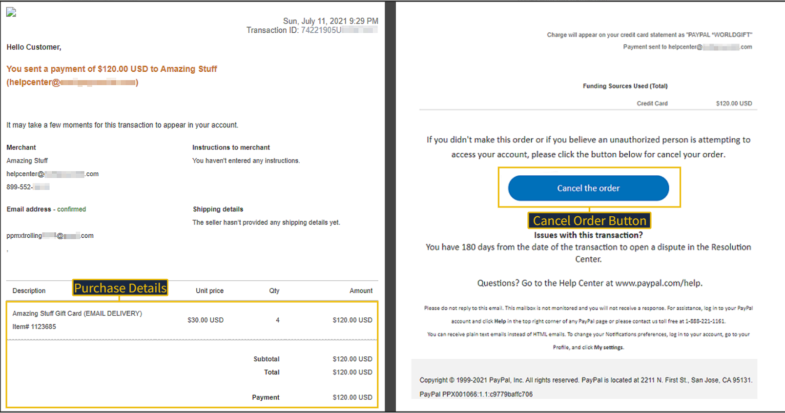
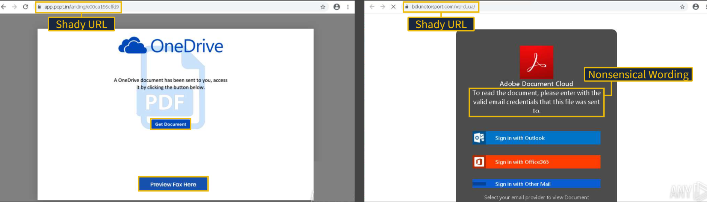

# 🛡️ Phishing Email Analysis and IOC Extraction

## 📌 Project Overview

This project demonstrates a structured phishing email investigation workflow based on six realistic phishing investigation scenarios.

Each case study was analyzed using a Security Operations Center (SOC) investigation methodology to identify phishing indicators, extract Indicators of Compromise (IOCs), assess potential security risks, identify detection opportunities, and document findings in a structured incident report.

The project focuses on practical SOC Level 1 skills including phishing triage, email analysis, IOC extraction, threat analysis, risk assessment, MITRE ATT&CK mapping, and security documentation.

---

## 🎯 Project Objectives

- Analyze phishing emails using a structured investigation methodology.
- Identify phishing indicators and social engineering techniques.
- Extract and document Indicators of Compromise (IOCs).
- Analyze suspicious links, attachments, domains, and email content.
- Assess security risks and potential business impact.
- Identify detection opportunities for security teams.
- Map relevant phishing techniques to the MITRE ATT&CK Framework.
- Recommend appropriate mitigation and response actions.
- Document investigation findings in a professional incident-report format.

---

## 📂 Repository Structure

```text
Phishing-Email-Analysis-and-IOC-Extraction
│
├── README.md
│
├── Reports
│   ├── Case_Study_1_DHL_Express.pdf
│   ├── Case_Study_2_Track_Your_Package.pdf
│   ├── Case_Study_3_PayPal_Recent_Purchase.pdf
│   ├── Case_Study_4_Download_Document.pdf
│   ├── Case_Study_5_Apple_Support.pdf
│   └── Case_Study_6_Netflix_Account.pdf
│
└── Screenshots
    ├── 01_DHL_Phishing_Email.png
    ├── 02_Package_Tracking_URL_Analysis.png
    ├── 03_PayPal_Malicious_Link_Analysis.png
    ├── 04_Credential_Phishing_Page.png
    ├── 05_Apple_Redirect_Link_Analysis.png
    └── 06_Netflix_Phishing_Email.png
```

---

## 📄 Case Studies

| # | Case Study | Primary Focus | Report |
|---|---|---|---|
| 1 | DHL Express Shipment Notification | Malicious Attachment | [View Report](Reports/Case_Study_1_DHL_Express.pdf) |
| 2 | Track Your Package | Malicious Hyperlink / URL Analysis | [View Report](Reports/Case_Study_2_Track_Your_Package.pdf) |
| 3 | PayPal Recent Purchase | Malicious Link / Credential Phishing | [View Report](Reports/Case_Study_3_PayPal_Recent_Purchase.pdf) |
| 4 | Download Document | Phishing Link / Credential Harvesting | [View Report](Reports/Case_Study_4_Download_Document.pdf) |
| 5 | Apple Support | Malicious Attachment / Redirect Analysis | [View Report](Reports/Case_Study_5_Apple_Support.pdf) |
| 6 | Netflix Account | Brand Impersonation / Phishing Analysis | [View Report](Reports/Case_Study_6_Netflix_Account.pdf) |

---

## 🔍 Investigation Methodology

Each phishing scenario was investigated using a structured SOC workflow:

1. **Executive Summary**
2. **Scenario Overview**
3. **Phishing Indicators Identification**
4. **IOC Extraction**
5. **Email, URL, and Attachment Analysis**
6. **Analysis Findings**
7. **Detection Opportunities**
8. **Risk Assessment**
9. **MITRE ATT&CK Mapping**
10. **Recommended Response Actions**
11. **Conclusion**

This approach helps demonstrate how a SOC analyst can move from initial phishing triage to evidence-based investigation and documentation.

---

## 🧪 IOC Analysis

The investigations focused on identifying and documenting relevant indicators such as:

- Sender email addresses
- Suspicious domains
- Malicious URLs
- Redirect URLs
- File and attachment indicators
- Suspicious filenames
- Tracking URLs
- Credential-harvesting pages
- Other observable phishing artifacts

Extracted IOCs were analyzed and documented within the individual case-study reports.

---

## 🛠️ Skills Demonstrated

- Phishing Email Analysis
- Phishing Triage
- IOC Extraction
- Email Threat Investigation
- URL Analysis
- Attachment Analysis
- Social Engineering Analysis
- Credential Phishing Detection
- Threat Intelligence Analysis
- Risk Assessment
- Detection Engineering
- MITRE ATT&CK Mapping
- Security Documentation
- SOC Investigation Methodology

---

## 🧰 Tools & Platforms

- TryHackMe
- VirusTotal
- CyberChef
- Email Header Analysis
- MITRE ATT&CK Framework

---

## 📸 Investigation Evidence

Selected investigation screenshots are available in the [`Screenshots`](Screenshots/) directory.

### DHL Phishing Email



### Package Tracking URL Analysis



### PayPal Malicious Link Analysis



### Credential Phishing Page



### Apple Redirect Link Analysis


### Netflix Phishing Email


---

## 🎓 Learning Outcomes

Through this project, I gained practical experience in:

- Identifying phishing indicators and social engineering techniques.
- Extracting and documenting Indicators of Compromise.
- Investigating suspicious URLs, attachments, and email content.
- Recognizing credential-harvesting and brand-impersonation techniques.
- Performing structured phishing investigations.
- Assessing potential security risks and business impact.
- Identifying opportunities for security detection and response.
- Applying MITRE ATT&CK techniques to phishing scenarios.
- Creating structured incident investigation reports.

---

## 📈 Project Outcome

This project contains six structured phishing investigation reports covering different phishing scenarios and attack techniques.

Each investigation demonstrates a repeatable SOC workflow from initial analysis and IOC extraction through risk assessment, detection opportunities, MITRE ATT&CK mapping, and recommended response actions.

The project demonstrates practical skills relevant to entry-level **SOC Analyst / SOC L1** roles, particularly in phishing triage, threat analysis, IOC handling, and security investigation documentation.

---

## 👨‍💻 Author

**Anji Gajula**

Cybersecurity Graduate | Aspiring SOC Analyst | SIEM | Threat Detection | Incident Response | Phishing Analysis

---

⭐ If you found this project useful, feel free to explore the individual case-study reports and investigation evidence.
